# School Community

## 项目设计

### 总体构成

项目使用了nodejs+express+mongodb开发。

校园社区系统，用户可以在系统中发布信息，也可以对别人发布的信息进行评论操作，互动性强，社交性质明显。

可以关注某位用户，查看某位用户所发布的所有信息。

账户分为普通用户和管理员用户，普通用户只对自己发布的信息有权力进行删除，而管理员对所有用户发布的信息和评论都有权力进行删除。

管理员账号为：用户名：admin，密码：123

### 引入包说明

- express：配置服务器路由
- mongoose：实现对数据库的相关操作
- bodyParser：读取POST数据
- session：使用session共享信息
- cookieParser：记录和读取浏览器cookie信息
- multer：上传文件
- fs：打开相关文件
- bootstrap：美化网页
- font-awesome：引入各种符号，美化网页

### 数据库设计

#### users表

|  列名称  | 数据类型 |   作用   |
| :------: | :------: | :------: |
| username |  String  |  用户名  |
| password |  String  |   密码   |
|   num    |  String  |   学号   |
|   sex    |  String  |   性别   |
| birthday |   Date   |   生日   |
|  major   |  String  |   专业   |
|  email   |  String  |   邮箱   |
| hobbies  |  String  |   爱好   |
| regtime  |  String  | 注册时间 |
| headimg  |  String  | 头像图片 |

#### publishes表

|  列名称  | 数据类型 |     作用     |
| :------: | :------: | :----------: |
| username |  String  | 发布者用户名 |
|   img    |  String  |   发布图片   |
|   text   |  String  | 发布文本信息 |
|   time   |  String  |   发布时间   |

#### comments表

|  列名称  | 数据类型 |       作用       |
| :------: | :------: | :--------------: |
|   p_id   | ObjectId | 被评论的信息的id |
| username |  String  |   评论者用户名   |
| comment  |  String  |     评论信息     |
|   time   |  String  |     评论时间     |
| headimg  |  String  |    评论者头像    |

### 目录结构

项目目录结构如下：

```
SchoolCommunity
├── demo.js
├── doc
├── modules
├── node_modules
├── package.json
├── package-lock.json
├── README.md
├── static
└── views
```

- demo.js：是核心代码，包括路由分配等功能；

- doc：保存说明文档中的截图文件

- modules：封装了数据库的连接，以及数据表的定义

  ```
  modules
  ├── comment.js
  ├── db.js
  ├── follow.js
  ├── publish.js
  ├── service.js
  └── user.js
  ```

  - comment.js：封装了评论表的代码
  - db.js：封装了连接数据库的代码
  - publish.js：封装了发布的信息表的代码
  - service.js：封装了各类对数据库进行操作的函数以及获得时间函数等等的代码
  - user.js：封装了用户信息表的代码

- node_modules：存放所有导入的包文件

- package.json, package-lock.json：所有导入的包的信息

- README.md：说明文档

- static：静态文件目录，存放图片资源以及用户上传的文件

  ```
  static
  ├── images
  └── upload
  ```

  - images：存放服务器的图片资源
  - upload：存放用户上传的图片

- views：存放所有ejs页面

  ```
  views
  ├── findPublishes.ejs
  ├── footer.ejs
  ├── header.ejs
  ├── home.ejs
  ├── left.ejs
  ├── login.ejs
  ├── nav.ejs
  ├── publish.ejs
  ├── reg.ejs
  ├── right.ejs
  ├── userInfo.ejs
  └── userList.ejs
  ```

## 使用说明

### 登陆界面

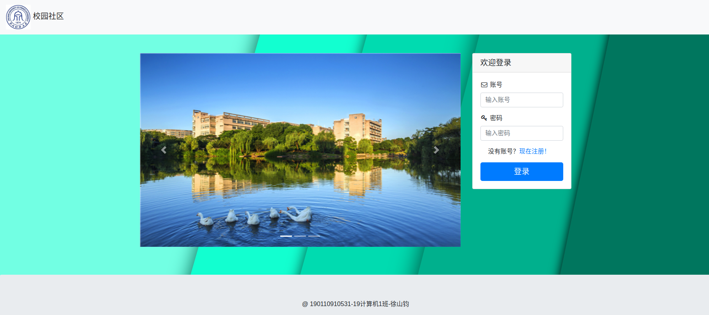

可以在此界面中进行登陆操作，也可点击“现在注册！”按钮跳转到注册界面。


### 注册界面

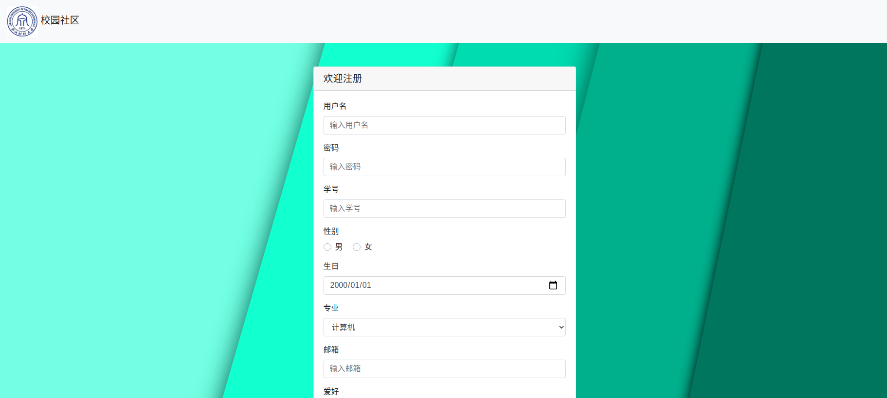

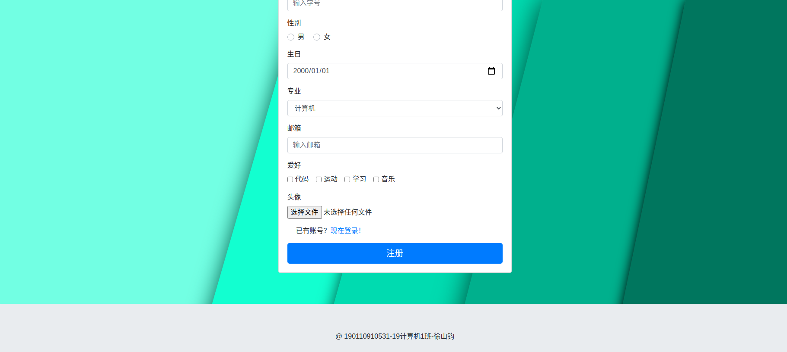

输入相关信息进行注册，也可点击“现在登陆！”按钮跳转到登陆界面。


### 主界面

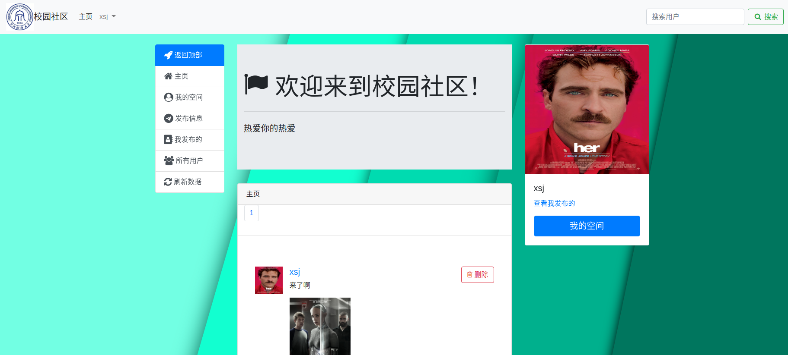

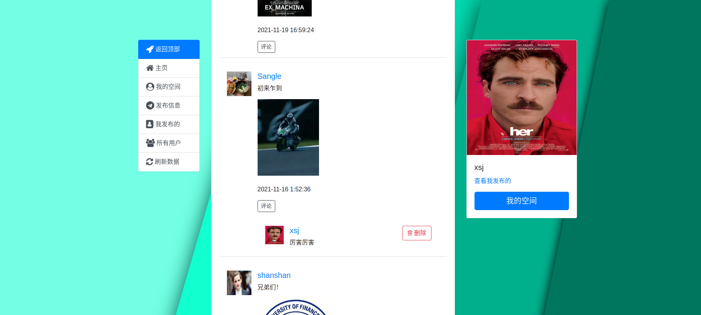

左侧为各种功能的导航栏，右侧为用户信息框，上方导航栏可以进行搜索用户以及退出操作，下方模块可以看到用户发的信息以及相关评论。


### 发布信息

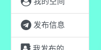

点击左侧“发布信息”按钮即可进入“发布信息”页面。


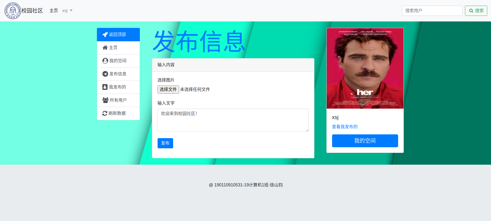

进入后输入发布的信息或者上传要附带发布的图片，点击“发布”按钮即可上传，刷新数据后其他用户可以在主界面看到。


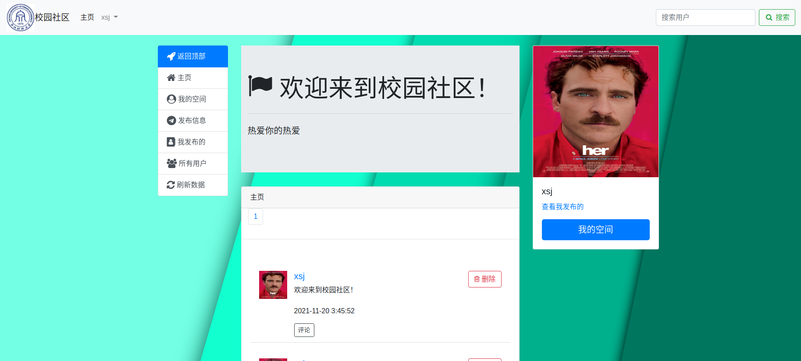

### 查看所有用户

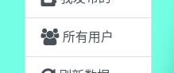

点击左侧导航栏“所有用户”按钮，即可查看系统中所有用户。


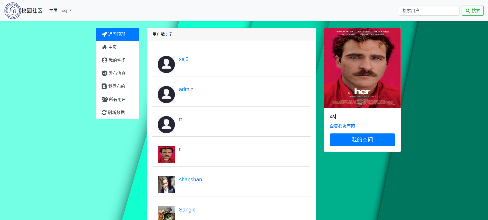

### 退出操作

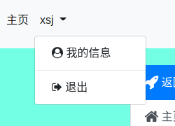

点击上方导航栏用户名字即可进行退出操作。


### 搜索用户

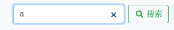

在导航栏右侧搜索框内输入相关字符可以对用户名进行模糊搜索。


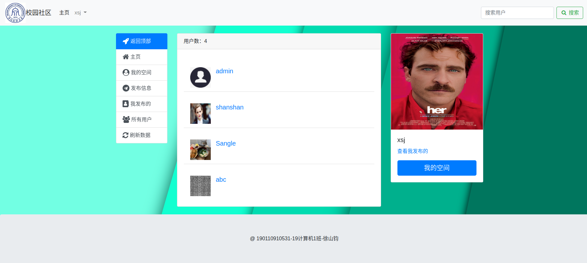

点击搜索按钮后，可看到搜索结果。


### 查看用户信息

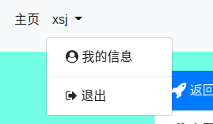

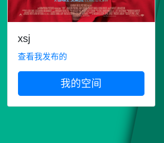

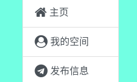

在上方导航栏用户下拉栏的“我的信息”按钮、右侧“我的空间”按钮以及左侧“我的空间”按钮都可以查看用户自身的信息。


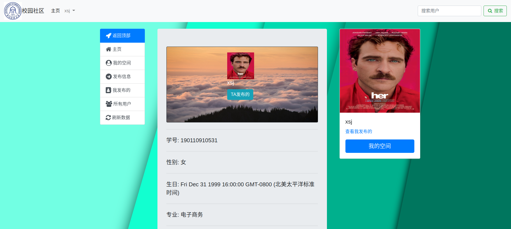

进入后可以看到用户个人的信息。


点击其他的用户的头像即可查看其他用户的信息。


### 查看用户发布

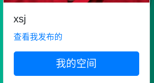

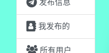

点击右侧的“查看我发布的”或者左侧的“我发布的”即可查看我发布的信息。


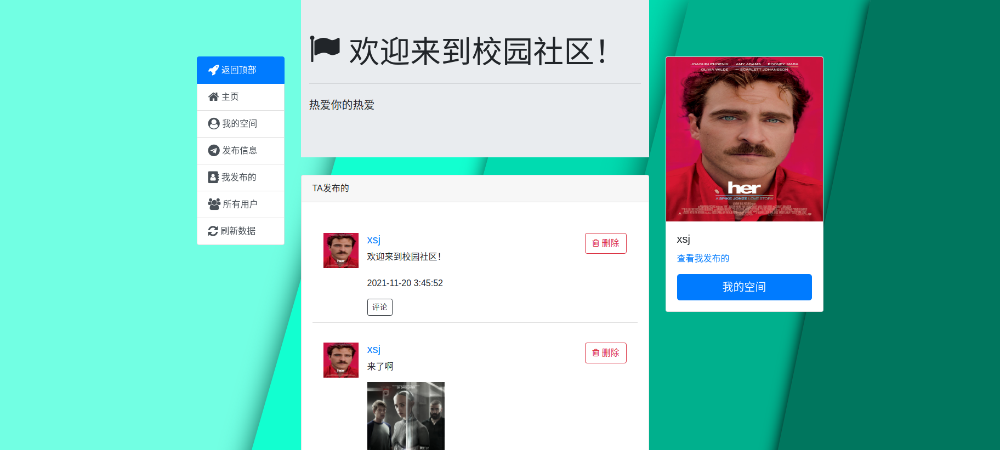

我发布的信息的界面。


点击其他用户的“TA发布的”按钮即可查看该用户发布的信息。


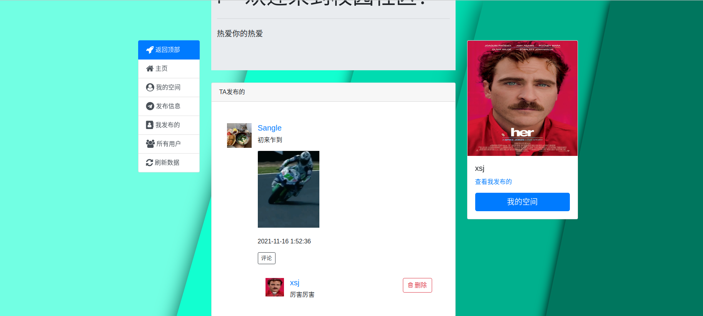

查看其他用户发布的信息。


### 删除信息或评论

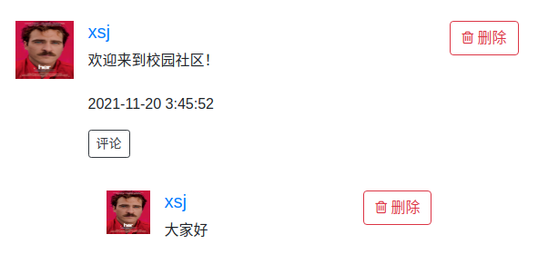

在自己发布的信息或者评论旁可点击“删除”按钮对信息或者评论进行删除操作。


### 刷新数据


点击左侧导航栏“刷新数据”按钮即可刷新主页数据（在发布和评论没有及时显示的情况下刷新即可显示）


### 管理员账户

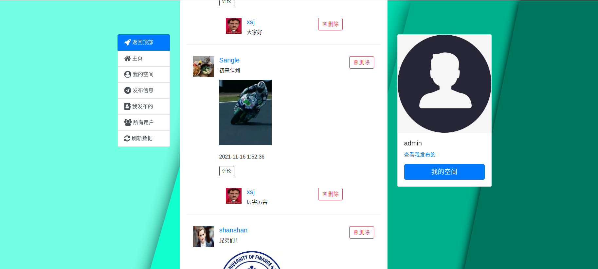

管理员账户对所有用户发布的信息及评论都有删除权限。


### 返回顶部


点击左侧导航栏“返回顶部”按钮即可返回网页顶部。


### 翻页

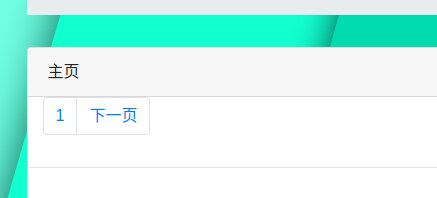

若数据过多，可以点击翻页按钮。


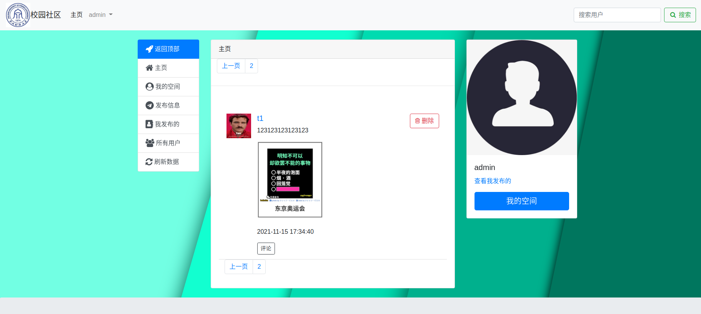

第二页的信息。


## 开发日志

### 2021-12-12

- 加入login.ejs界面
- 加入reg.ejs界面

### 2021-12-13

- 实现注册的数据库相关操作
- 实现登陆以及注册功能

### 2021-12-15

- 实现publish界面
- 实现publish界面数据库相关功能

### 2021-12-16

- 实现查看用户信息界面

- 实现查找用户功能

- 实现查看用户发布信息功能

- 优化界面

- 修复了一些bug

### 2021-12-18

- 加入了页面图标
- 美化界面

### 2021-12-21

- 增加管理员用户
- 优化翻页功能
- 更新说明文档
- 修复按时间排序问题

### 2021-12-23

- 更新说明文档
